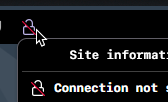
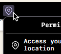
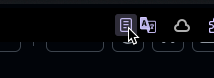
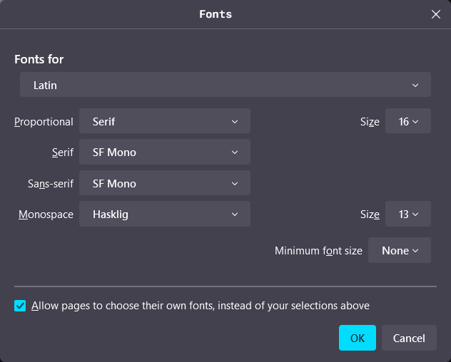
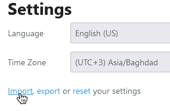

  

# Private, Secure and Minimalistic Firefox

Configs includes user.js and chrome folder for the theme.

https://github.com/user-attachments/assets/f68ca66d-f042-4529-8a0a-1da803331eeb

## Download Progress Bar!

https://github.com/user-attachments/assets/e1fe01e8-c039-4cd8-a40c-6f9659cafbfd

## Icons Only Show POP When They Are Needed.

- Connection not secure icon

  

- Always know what permissions are granted in a simple icon view

  

- Reader View Everywhere with NO Extension!

  

## Info

- The Fonts That Was Used

  [SF Mono](https://devimages-cdn.apple.com/design/resources/download/SF-Mono.dmg) For UI

  [SF Arabic](https://devimages-cdn.apple.com/design/resources/download/SF-Arabic.dmg) For Arabic

  [Hasklig](https://github.com/i-tu/Hasklig/releases/download/v1.2/Hasklig-1.2.zip) For Codes

  [Outfit Thin](https://github.com/Outfitio/Outfit-Fonts/raw/main/fonts/variable/Outfit%5Bwght%5D.ttf) For Tabliss New Tab Page Extension

- Try this in a new profile since this is going to override the prefs.js ([user.js](firefox-by-изз/profile/user.js)) config

- Extensions

  [Tabliss](https://addons.mozilla.org/en-US/firefox/addon/tabliss/) + [Config](firefox-by-изз/tabliss-template.json)

  [uBlock](https://addons.mozilla.org/en-US/firefox/addon/ublock-origin/)

  [FastForward](https://addons.mozilla.org/en-US/firefox/addon/fastforwardteam/)

  [Decentraleyes](https://addons.mozilla.org/en-US/firefox/addon/decentraleyes/)

- Themes

  Shades of Purple (Made by me)

  [Dark Space - Dynamic Theme](https://addons.mozilla.org/en-US/firefox/addon/nicothin-space/)

## Setup

- Fonts
  
  Go to "about:preferences" and in the general tab scroll down to "Fonts" and click on "Advanced"

  

  Choose these fonts

- Import Tabliss Configs
  
  Click on the gear icon -top left- and scroll down to settings

  

  Click on import and locate "tabliss-template.json"

- 

## Contributing

Contributions are always welcome!
