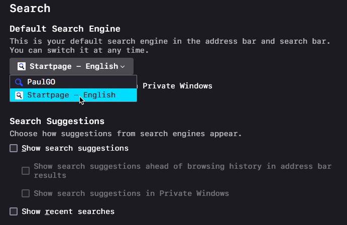

  
  

# Private, Secure and Minimalistic Firefox

Configs includes user.js and chrome folder for the theme.

https://github.com/user-attachments/assets/f68ca66d-f042-4529-8a0a-1da803331eeb

## Download Progress Bar!

https://github.com/user-attachments/assets/e1fe01e8-c039-4cd8-a40c-6f9659cafbfd

## Icons Only Show POP When They Are Needed.

- Connection not secure icon

  

- Always know what permissions are granted in a simple icon view

  

- Reader View Everywhere with NO Extension!

  

## Info

- The Fonts That Was Used

  [SF Mono](https://devimages-cdn.apple.com/design/resources/download/SF-Mono.dmg) For UI

  [Hasklig](https://github.com/i-tu/Hasklig/releases/download/v1.2/Hasklig-1.2.zip) For Codes

  [Outfit Thin](https://github.com/Outfitio/Outfit-Fonts/raw/main/fonts/variable/Outfit%5Bwght%5D.ttf) For Tabliss New Tab Page Extension

- Try this in a new profile since this is going to override the prefs.js ([user.js](firefox-by-изз/profile/user.js)) config

- Extensions

  [Tabliss](https://addons.mozilla.org/en-US/firefox/addon/tabliss/) + [Config](firefox-by-изз/tabliss-template.json)

  [uBlock](https://addons.mozilla.org/en-US/firefox/addon/ublock-origin/)

  [FastForward](https://addons.mozilla.org/en-US/firefox/addon/fastforwardteam/)

  [Decentraleyes](https://addons.mozilla.org/en-US/firefox/addon/decentraleyes/)

- Themes

  Shades of Purple (Made by me)

  [Dark Space - Dynamic Theme](https://addons.mozilla.org/en-US/firefox/addon/nicothin-space/)

- "exclusive-wallpapers" are wallpapers made by me to be used with this theme, no re-uploading or selling. All rights reserved

## Features

  - Clean New Tab Page with NO Extensions

  - Hover Effects and Light Animations

  - Rounded Corners For Modern Look

  - Distraction Free URL Bar That Shows Only The Needed Icons

  - Distraction Free Browsing There are NO Scrollbars!

  - Efficient configs That Can Let You Do Anything. So, no annoying firefox hardening stuff that breaks websites.

  - It's the [FASTEST](https://github.com/yokoffing/Betterfox) + My own modifications to make it even more better.

  - Smooth Scroll Everywhere!

  - ClearType Font Rendering (soon)

## Setup

- Fonts
  
  Go to "about:preferences" and in the general tab scroll down to "Fonts" and click on "Advanced"

  

  Choose these fonts

- Import Tabliss Configs
  
  Click on the gear icon -top left- and scroll down to settings

  

  Click on import and locate "tabliss-template.json"

- Changing the search engine

  Go to "about:preferences" and to the search tab

  

  And choose your search engine

- Hiding search engine suggestions for cleaner look

  Go to "about:preferences" and to the search tab

  

  Uncheck the blue check mark and remove anything that can be removed. Make sure default search engine is set to Startpage.

## Contributing

Help me improve this and make it perfect!

